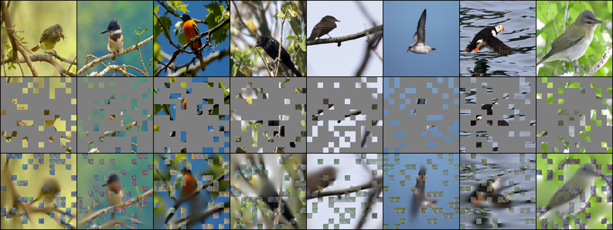
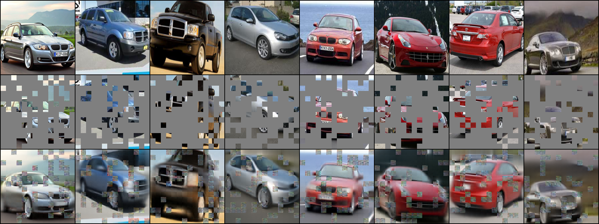
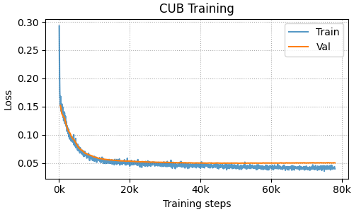

<div align=center>
<h1>Masked Autoencoders in PyTorch</h1>

<a href="https://pytorch.org/get-started/locally/"></a>
<a href="https://pytorchlightning.ai/"></a>


</div>

A simple, unofficial implementation of MAE ([Masked Autoencoders are Scalable Vision Learners](https://arxiv.org/abs/2111.06377)) using  [pytorch-lightning](https://www.pytorchlightning.ai/). A PyTorch implementation by the authors can be found [here](https://github.com/facebookresearch/mae).

Currently implements training on [CUB](http://www.vision.caltech.edu/visipedia/CUB-200-2011.html), [StanfordCars](http://ai.stanford.edu/~jkrause/cars/car_dataset.html), [STL-10](https://cs.stanford.edu/~acoates/stl10/) but is easily extensible to any other image dataset.

## Updates

### September 1, 2023

- Updated for compatibility with Pytorch 2.0 and PyTorch-Lightning 2.0. This probably breaks backwards compatibility. Created a release for the old version of the code.
- Modified parts of the training code for better conciseness and efficiency.
- Added additional features, including the option to save some validation reconstructions during training. **Note**: having trouble with saving reconstructions during distributed training; freezes at the end of the validation epoch.
- Retrained CUB and Cars models with new code and a stronger decoder.

### February 4, 2022

- Fixed a bug in the code for generating mask indices. Retrained and updated the reconstruction figures (see below). They aren't quite as pretty now, but they make more sense.

## Setup

```bash
# Clone the repository
git clone https://github.com/catalys1/mae-pytorch.git
cd mae-pytorch

# Install required libraries (inside a virtual environment preferably)
pip install -r requirements.txt

# Set up .env for path to data
echo "DATADIR=/path/to/data" > .env
```

## Usage

### MAE training

Training options are provided through configuration files, handled by [LightningCLI](https://pytorch-lightning.readthedocs.io/en/stable/common/lightning_cli.html). See `config/` for examples.

Train an MAE model on the CUB dataset:
```bash
python train.py fit -c config/mae.yaml -c config/data/cub_mae.yaml
```

Using multiple GPUs:
```bash
python train.py fit -c config/mae.yaml -c config/data/cub_mae.yaml --trainer.devices 8
```
### Linear probing (currently only supported on STL-10)
Evaluate the learned representations using a linear probe. First, pretrain the model on the 100.000 samples of the 'unlabeled' split.
```bash
python train.py fit -c config/mae.yaml -c config/data/stl10_mae.yaml
```
Now, append a linear probe to the last layer of the frozen encoder and discard the decoder. The appended classifier is then trained on 4000 labeled samples of the 'train' split (another 1000 are used for training validation) and evaluated on the 'test' split. To do so, simply provide the path to the pretrained model checkpoint in the command below.

```bash
python linear_probe.py -c config/linear_probe.yaml -c config/data/stl10_linear_probe.yaml --model.init_args.ckpt_path <path to pretrained .ckpt>
``` 

This yields 77.96\% accuracy on the test data.


### Fine-tuning

Not yet implemented.

## Implementation

The default model uses ViT-Base for the encoder, and a small ViT (`depth=6`, `width=384`) for the decoder. This is smaller than the model used in the paper.

## Dependencies

- Configuration and training is handled completely by [pytorch-lightning](https://pytorchlightning.ai).
- The MAE model uses the VisionTransformer from [timm](https://github.com/rwightman/pytorch-image-models).
- Interface to FGVC datasets through [fgvcdata](https://github.com/catalys1/fgvc-data-pytorch).
- Configurable environment variables through [python-dotenv](https://pypi.org/project/python-dotenv/).

## Results

Image reconstructions of CUB validation set images after training with the following command:
```bash
python train.py fit -c config/mae.yaml -c config/data/cub_mae.yaml --data.init_args.batch_size 256 --data.init_args.num_workers 12
```



Image reconstructions of Cars validation set images after training with the following command:
```bash
python train.py fit -c config/mae.yaml -c config/data/cars_mae.yaml --data.init_args.batch_size 256 --data.init_args.num_workers 16
```



### Hyperparameters

| Param          | Setting      |
| --             | --           |
| GPUs           | 1xA100       |
| Batch size     | 256          |
| Learning rate  | 1.5e-4       |
| LR schedule    | Cosine decay |
| Warmup         | 10% of steps |
| Training steps | 78,000       |


### Training

Training and validation loss curves for CUB.



Validation image reconstructions over the course of training.


